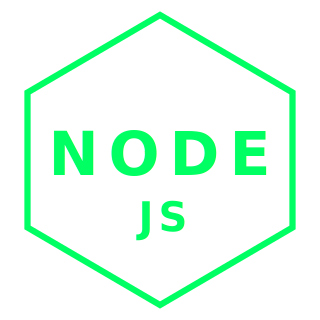
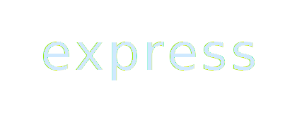
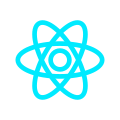
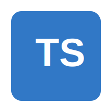

<!-- ======================== -->
<!--     TRON HEADER PRO      -->
<!-- ======================== -->

  

 

  

 

# 
⚡ Bienvenido al <strong> Grid </strong>

Desarrollador <strong>Full Stack</strong> en formación con un enfoque futurista, minimalista y limpio.  
Trabajo con <strong>JavaScript, TypeScript, Node.js, React y Next.js</strong>.  
Me gusta crear interfaces claras, sistemas ordenados y experiencias con vibra TRON ⚡.

 

  

 

<h2 align="center">⚡ Stack </h2>

  <!-- FILA 1: 4 íconos -->
  

    
    
    
    
  

  <!-- FILA 2: 3 íconos -->
  

    
    
    
  

  <!-- FILA 3: 1 ícono -->
  

    
  

 

  

 

# 🟦 Projects

<h4 align="center">
  Updating...
</h4>

 

  

 

# 🔥 Estado del Sistema

  

  

 

# 🌀 Sobre mí

🔹 Enfocado en convertirme en desarrollador profesional.  
🔹 Mejorando backend y frontend al mismo tiempo.  
🔹 Me gusta escribir código limpio, ordenado y visualmente elegante.  
🔹 Aficionado al diseño digital estilo TRON ⚡.  
🔹 Siempre aprendiendo, siempre mejorando.

  

  

  

# 
 The first time I saw the Grid, I knew I wanted to build something there. 

  

