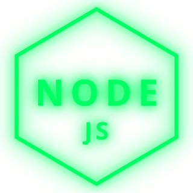

# Esmil Adames

**Full Stack Software Engineer · Backend Developer**

Diseño y construyo aplicaciones web robustas de extremo a extremo, con foco en TypeScript, Node.js y React.
Priorizo arquitecturas mantenibles, tipado estricto y APIs predecibles sobre soluciones rápidas y frágiles.
Interesado en diseño de sistemas, modelado de datos y código que escale sin fricción.

 

 

---

 

### Tech Stack

<table border="0" width="100%">
  <tr>
    <td align="center" width="33%">
      <strong>BACKEND &amp; CORE</strong>  
      &nbsp;&nbsp;
      &nbsp;&nbsp;
      &nbsp;&nbsp;
      
    </td>
    <td align="center" width="33%">
      <strong>FRONTEND &amp; UI</strong>  
      &nbsp;&nbsp;
      
    </td>
    <td align="center" width="33%">
      <strong>DEVOPS &amp; TOOLING</strong>  
      &nbsp;&nbsp;
      
    </td>
  </tr>
</table>

 

---

 

### Featured Projects

<table border="0" width="100%" cellpadding="14" style="border-collapse:separate; border-spacing:12px 0;">
  <tr>
    <td width="50%" valign="top" style="background-color:#0d1117; border-radius:12px; padding:20px;">
      <strong>ContactBook</strong> 
      Descripción técnica breve: qué problema resuelve y cómo está construido.  
      
      
        
      
    </td>
    <td width="50%" valign="top" style="background-color:#0d1117; border-radius:12px; padding:20px;">
      <strong>Countdless</strong> 
      Landing page interactiva y responsive.  
      
        
      
    </td>
  </tr>
</table>

 

---

 

### Engineering & System Design Principles

<table border="0" width="100%">
  <tr>
    <td width="33%" valign="top">
      <strong>Architecture & Layer Separation</strong> 
      APIs mantenibles, código desacoplado y tipado estricto de extremo a extremo.
    </td>
    <td width="33%" valign="top">
      <strong>Data Modeling & Integrity</strong> 
      Estructuración eficiente de bases de datos y flujos de información predecibles.
    </td>
    <td width="33%" valign="top">
      <strong>Pragmatic Problem Solving</strong> 
      Código limpio, patrones de diseño pertinentes y foco en valor de producto.
    </td>
  </tr>
</table>

 

---

 

